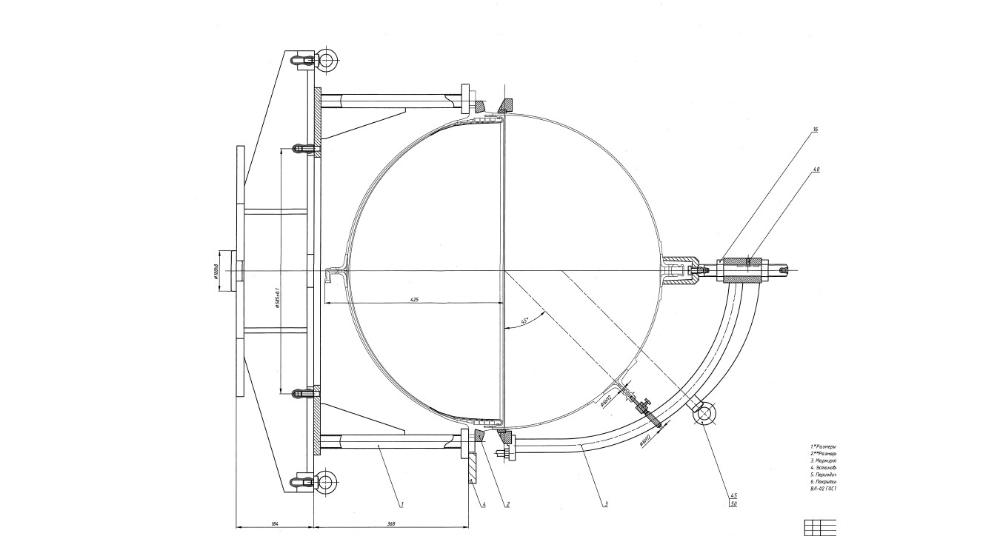

# Инструкции для работоты с MarkDown
## Выделение текста 
Чтобы выделить текст курсивом необходимо обрамить его  *звездочками* (*)
_Или обрамить знаком нижнего подчеркивания (_)_

Чтобы выделить текст полужирным, необходимо обрамить его **двойными звездочками** (**)
__Или двойным знаком нижнего подчеркивания (__)__

Альтернативные способы выделения текста жирными и курсивом нужны, для того, чтобы мы могли совмещать оба этих способа. НАпример,
_текст может быть курсивом и при этом быть **полужирным**_

 ~~Зачеркнутый текст надо обрамить двройным знаком~~ (вот так ~~)
## Списки
* Чтобы добавить ненумерованные списки, необходимо пункты выделить звездочкой в начале строки(*)
+ Или знаком (+) 
- Или знаком (-)

1. Чтобы добавить нумерованные списки, необходимо просто пронумеровать
## Работа с изображениями
Чтобы вставить images в text, необходимо сделать следующее:

## Ссылки
* какой текст и вставляю ссылку [link](https://google.com)
+ ccылка внутри проекта в круглых скобках начать с (/.) [link to jpg.md](./TestImages.jpg)

## Работа с таблицами
first | second | third
:---: | :---: | :---:
*name* | 1236456734.234345 | description
**Family** | 1236456734.234345 | description
*Firstname* | 1236456734.234345 | description
~~*name* | 1236456734.234345 | description~~
## Цитаты
-- Цитата это знак (>)--
>Это цитата
## Заключение
продолжаем изучbть git
А можно ДЗ приложить ссылкой на гит?
Давайте поругаемся)
FFFFFFFFFFFFFFFFFFFFFFFFFFFFFFFFFFFFF
AAAAAAAAAAAAAAAAAAAAAAAAAAAAAAAAAA
TTTTTTTTTTTTTTTTTTTTTTTTTTTTTTTTTTTTTTTTTTT
LLLLLLLLLLLLLLLLLLLLLLLLLLLLLLLLLLLLLLLLLLLLL